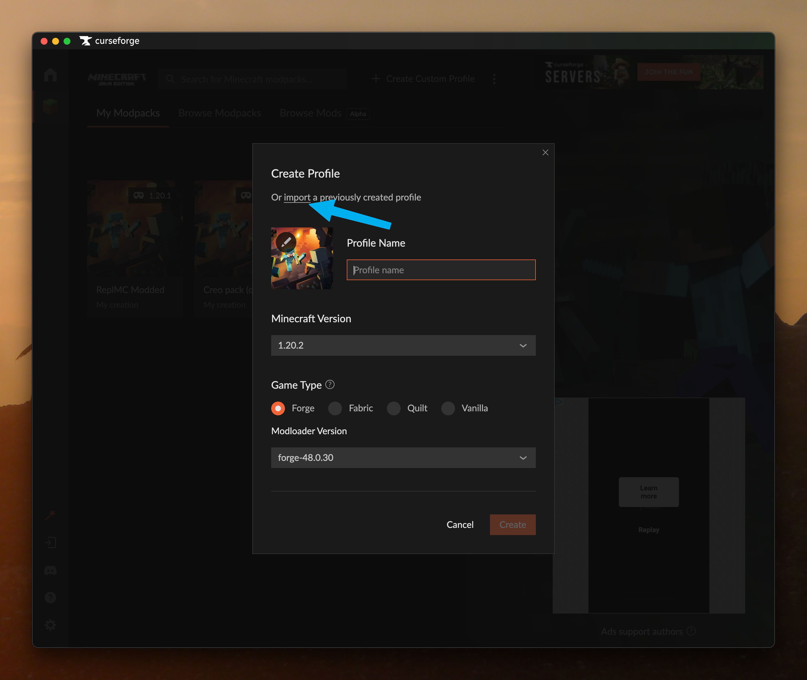
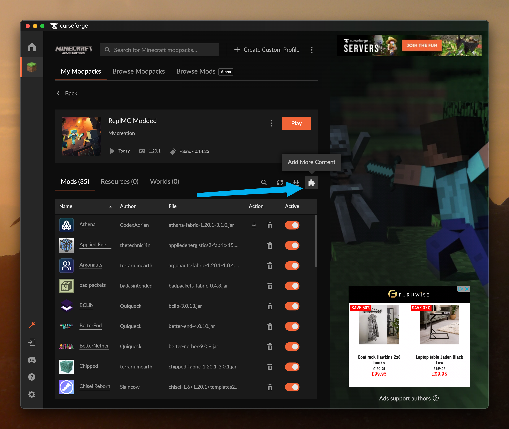
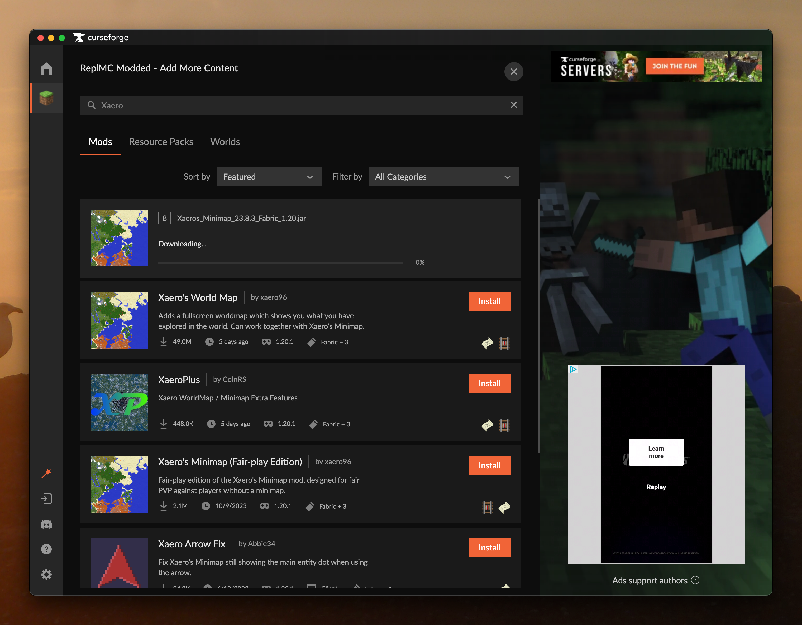
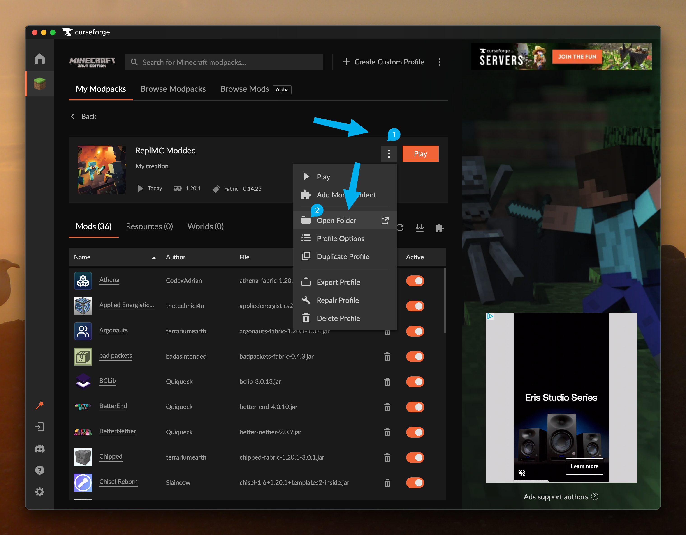

# CurseForge

This is a guide to installing the modpack for ReplMC Modded with the CurseForge app.

If you've never used the CurseForge app before, you'll need to download it from [here](https://www.curseforge.com/download/app).

## Downloading the Modpack

To make it quick to join the server, we've created a modpack that you can import into your launcher. This includes all of the required mods as well as performance mods.

You should download the `CurseForge.zip` file from [here](https://drive.google.com/drive/folders/1ciSTt7VAKdmNNjalJy4xCAKAU2Owup_U?usp=share_link).

## Installing the Modpack

Once you've downloaded the modpack, you'll need to install it.

1. Inside the app, press the `Create Custom Profile` button at the top right.

2. Then, press `import a previously created profile` and select the file you downloaded.

3. That's it! You can now launch the pack and connect to the server.
4. Press Play. This will open the default Minecraft Launcher. Sign in if needed then press play again.

## Installing Additional Mods

Now, we've not included all of the mods that you might want. The pack does include JEI and Mod Menu, but you may want to add more such as a minimap. This is doable in the app for any mods that are hosted on CurseForge.

### CurseForge-hosted mods

1. Open your instance settings then press the jigsaw icon.

2. Search for a mod that you want in the `Mods` tab. Then, hit the install button. You can see a list of mods we recommend [here](docs/modded/mods/recommended).

3. That's it! When you launch your pack next, the mods you installed will be there for you.

### Other mods

Not all mods are on Curseforge. You'll find a large selection of mods on [Modrinth](https://modrinth.com). Here's how to install them.

1. Find a mod you want and download the 1.20.1 Fabric version from Modrinth.
2. Inside the CurseForge app, press this button.

3. Next, drag the mod you downloaded into the `mods` folder.
4. That's it! When you launch your pack next, the mods you installed will be there for you.