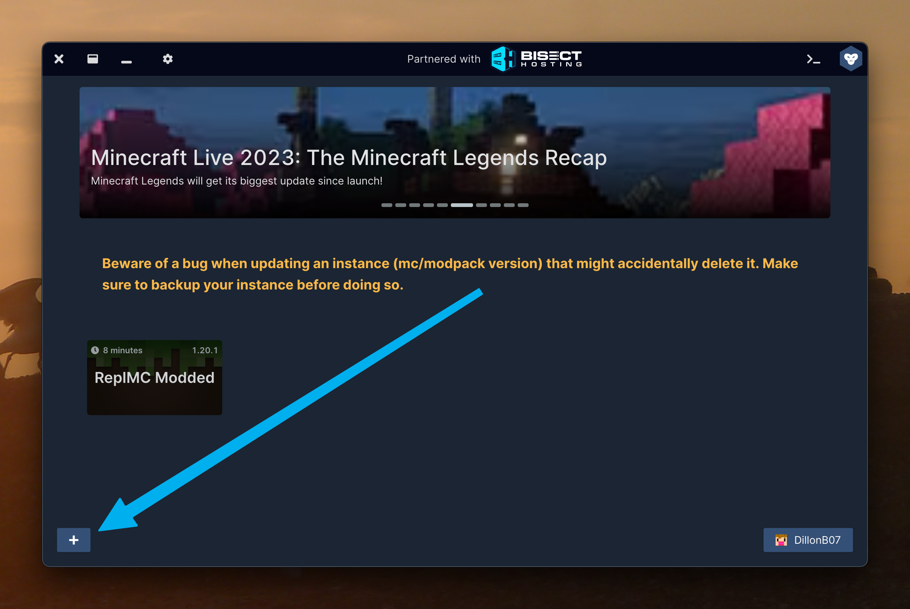
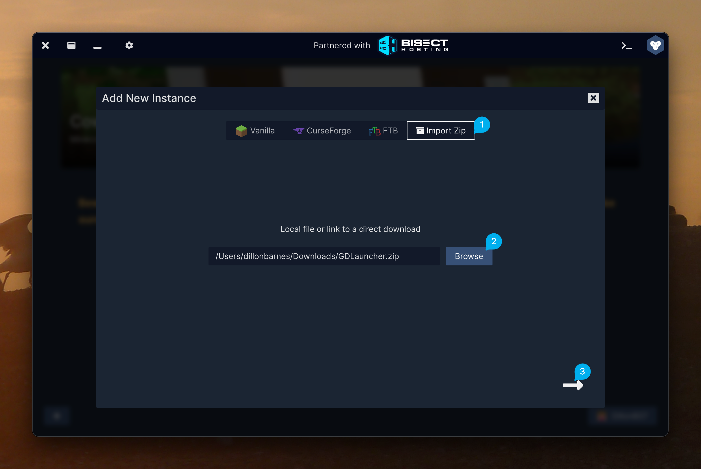
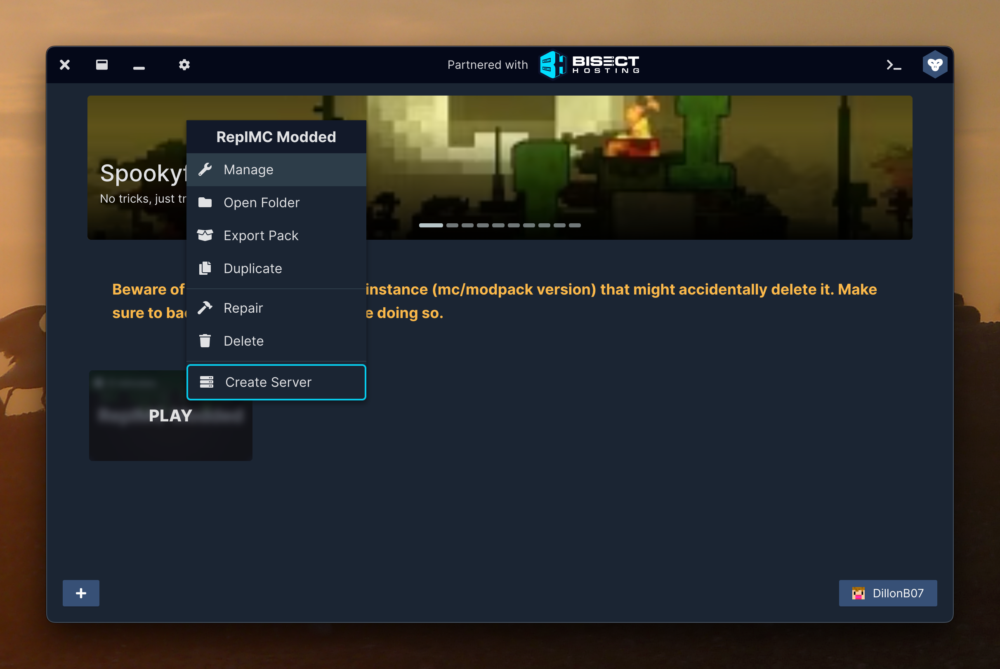
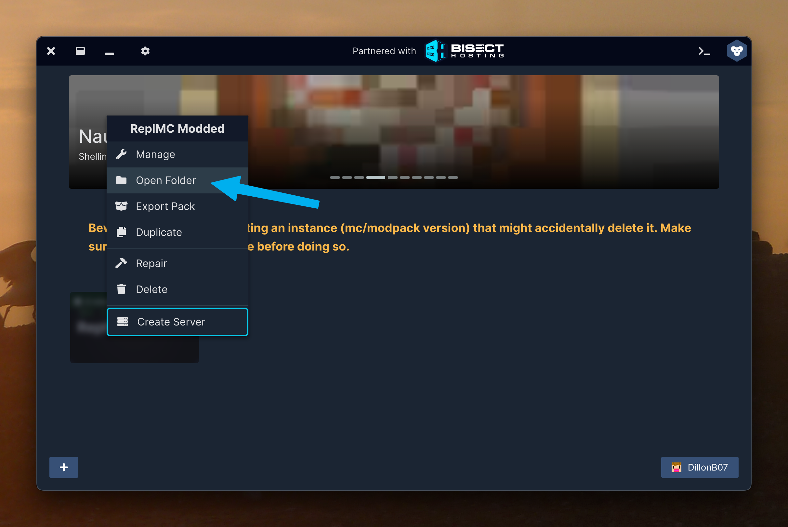

# GDLauncher

This is a guide to installing the modpack for ReplMC Modded with GDLauncher.

If you've never used GDLauncher before, you'll need to download it from [here](https://gdlauncher.com).

## Downloading the Modpack

To make it quick to join the server, we've created a modpack that you can import into your launcher. This includes all of the required mods as well as performance mods.

You should download the `GDLauncher.zip` file from [here](https://drive.google.com/drive/folders/1ciSTt7VAKdmNNjalJy4xCAKAU2Owup_U?usp=share_link).

## Installing the Modpack

Once you've downloaded the modpack, you'll need to install it. 

1. Inside GD, press the `+` in the bottom left corner.

2. Go to the `Import Zip` tab and press `Browse`. Then, select the file you downloaded.

3. Press `->` and wait for the pack to install. This may take a while as it will download all of the mods. There may be a few mods which it cannot automatically download. If this happens, press the `Confirm` button and don't press anything.

4. That's it! You can now launch the pack and join the server.

## Installing Additional Mods

Now, we've not included all of the mods that you might want. The pack does include JEI and Mod Menu, but you may want to add more such as a minimap. This is doable in the app for any mods that are hosted on CurseForge.

### CurseForge-hosted mods

1. Open your instance settings.

2. Open the `Mods` tab then press `Add mod`. Search for a mod that you want, Then, hit the install button on the mod. You can see a list of mods we recommend [here](docs/modded/mods/recommended).
3. That's it! When you launch your pack next, the mods you installed will be there for you.

### Other mods

Not all mods are on Curseforge. You'll find a large selection of mods on [Modrinth](https://modrinth.com). Here's how to install them.

1. Find a mod you want and download the 1.20.1 Fabric version from Modrinth or another site.

2. Inside the app, press this button.

3. Next, drag the mod you downloaded into the `mods` folder.
4. That's it! When you launch your pack next, the mods you installed will be there for you.