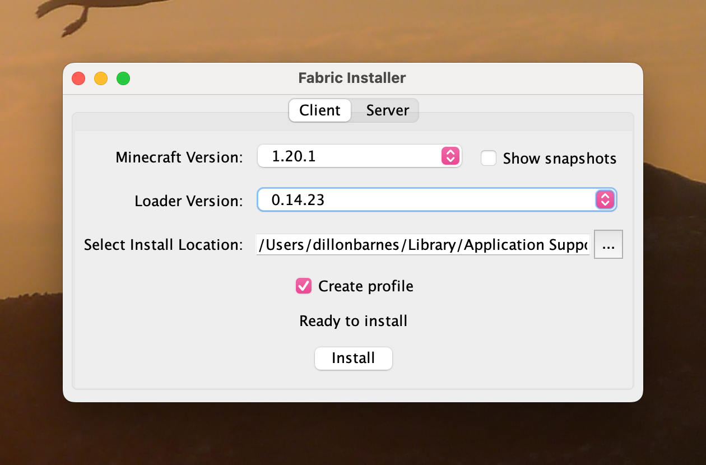
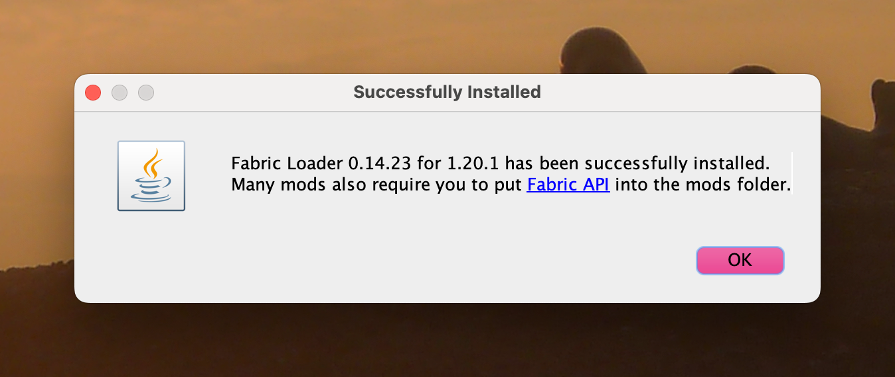
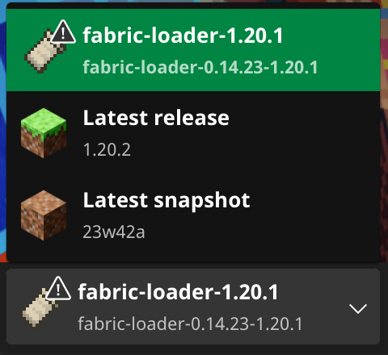
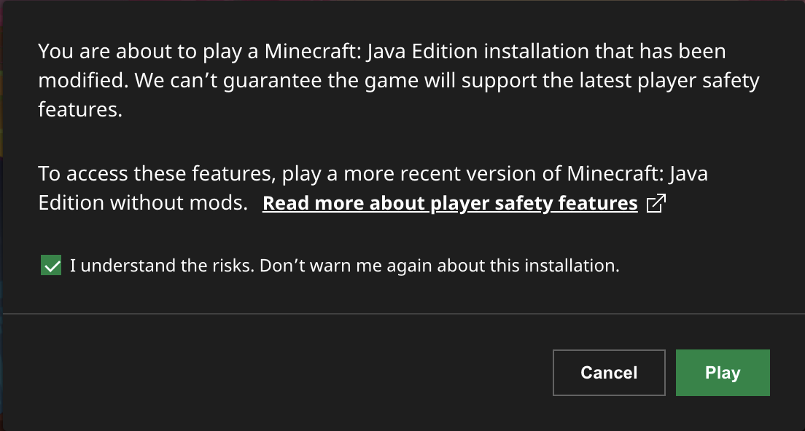

# Official Launcher

:::caution Note
Managing mods with the official launcher requires manually editing the files which makes it incredibly easy to make mistakes. It is recommended to use a launcher with mod management features instead. If you aren't sure what to choose, we recommend [Prism](prism) which makes it very easy easy to install modpacks and mods.
:::

## Installing mods

The first thing to do in the official launcher is to install the Fabric mod loader.

1. Visit the [Fabric download page](https://fabricmc.net/use/installer) and download the Universal installer. This will work regardless of your OS if you have Java installed.
2. Run the file you downloaded and select `Minecraft Version: 1.20.1` and `Loader Version: 0.14.24`. The Install Location should be left as the default. Make sure that the `Create profile` box is checked and then press `Install`.
   
3. Once you've received this success message, open the Minecraft Launcher.
   
4. In the profile list you should see Fabric. Make sure that it is selected. Then, press `Play`
   
5. Select the checkbox to not get this warning every time you open the profile. This is shown because the game is modified and the launcher doesn't know what has been changed. Press `Play`. Once Minecraft has launched into the main menu, close the game.
   
6. Next, download the `mods.zip` file from [here](https://drive.google.com/drive/folders/1ciSTt7VAKdmNNjalJy4xCAKAU2Owup_U?usp=share_link).
7. Extract it with your preferred archive utility and move all of the files into your `.minecraft/mods` folder. You may need to create the `mods` folder if it doesn't exist.

Locations of the `minecraft` folder:

| Operating System | Location                                  |
| ---------------- | ----------------------------------------- |
| Linux            | `~/.minecraft`                            |
| macOS            | `~/Library/Application Support/minecraft` |
| Windows          | `%APPDATA%\.minecraft`                    |

8. That's it! Launching the game should now have all of the mods working.
9. Connect to the server at `mc.repl.game`
