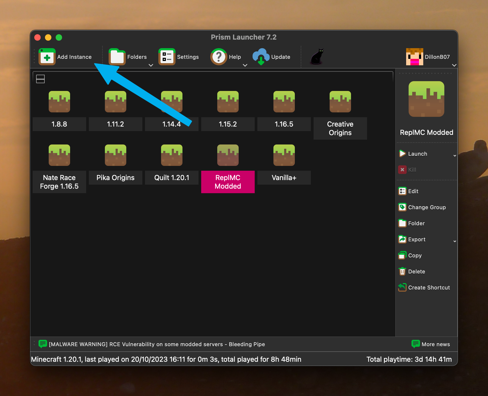
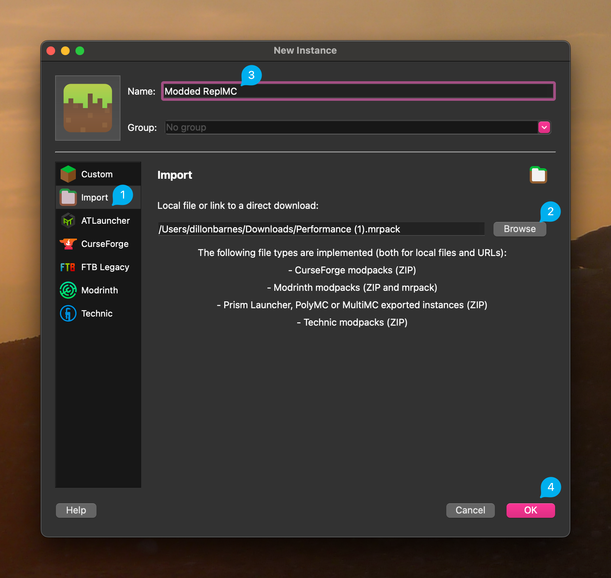
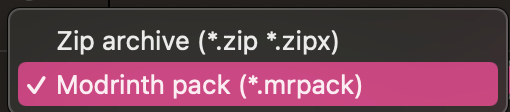
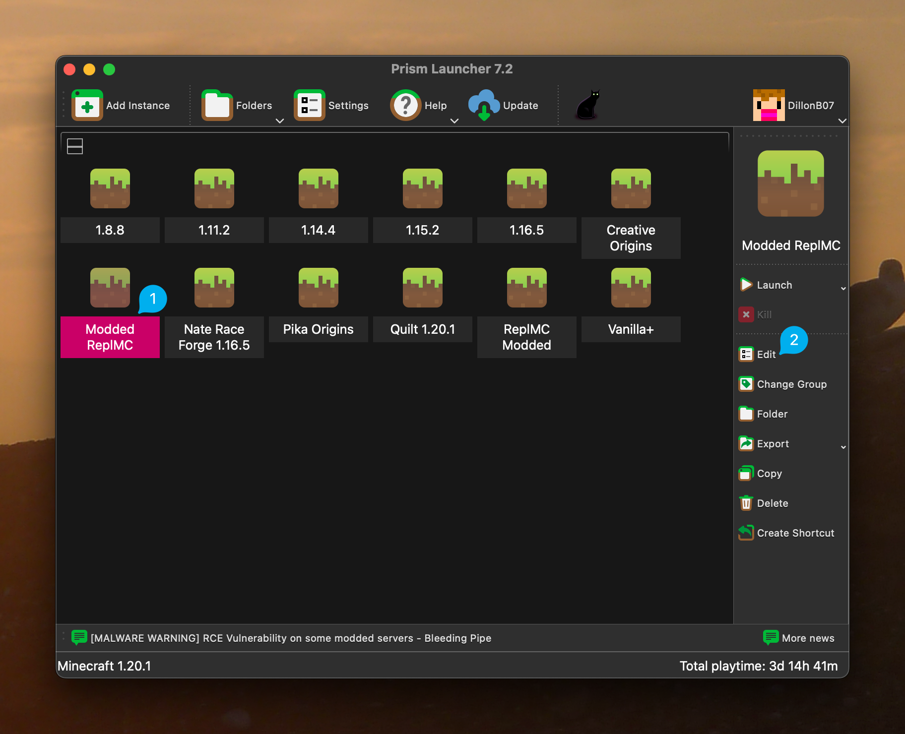
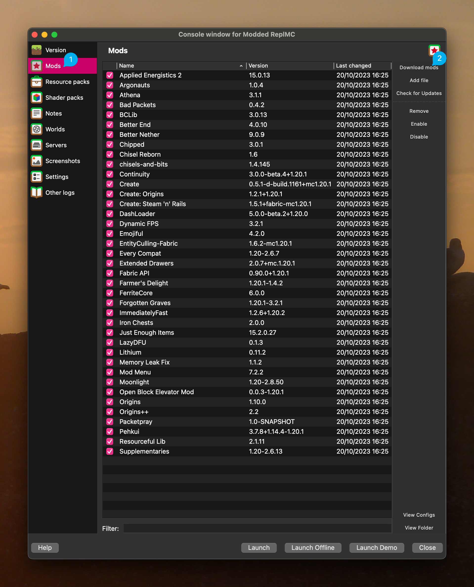
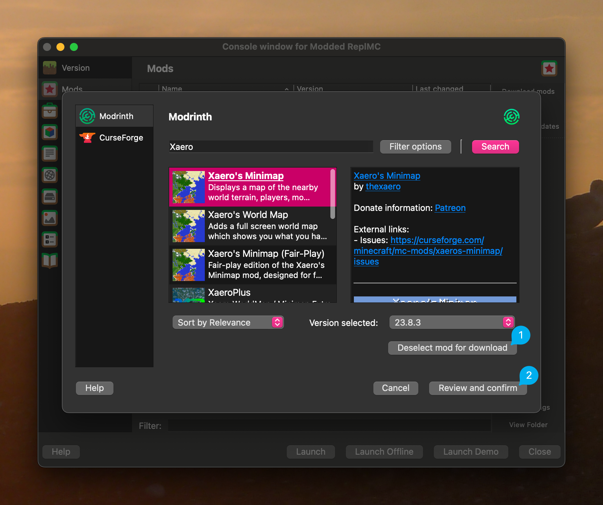

# Prism Launcher

This is a guide to installing the modpack for ReplMC Modded with Prism Launcher.

If you've never used Prism before, you'll need to download it from [here](https://prismlauncher.org).

## Downloading the Modpack

We have two modpacks available for you to download.

1. The bare bones pack - This includes only what you need to join and no performance or Quality of Life mods
2. The performance pack - This includes everything in the bare-bones pack and performance mods to improve your experience.

You can download those from [here](https://drive.google.com/drive/folders/1ciSTt7VAKdmNNjalJy4xCAKAU2Owup_U?usp=share_link).

## Installing the Modpack

Once you've downloaded the modpack, you'll need to install it. The process is the same regardless of which pack you downloaded.

1. Inside Prism, press `Add Instance` in the top left corner.

2. Go to the `Import` tab and press `Browse`. Then, select the file you downloaded. You may need to change the file format to `Modrinth pack (*.mrpack)` to be able to select the file.

3. Press `OK` and wait for the pack to install. This may take a while as it will download all of the mods.
4. That's it! You can now launch the pack and join the server.

## Installing Additioanl Mods

Now, we've not included all of the mods that you might want. Both of the packs include JEI and Mod Menu, but you may want to add more such as a minimap. This is very simple in Prism.

1. Navigate to your instance settings

2. Go to the `Mods` tab and press `Download mods`

3. Search for a mod you want to download. You can see a list of mods we recommend [here](/modded/mods/recommended).
4. Once you've found a mod that you'd like, press `Select mod for download` and then `Review and Confirm`. Once confirmed, the mod will be downloaded and installed.

5. That's it! When you launch your pack next, the mods you installed will be there for you.
